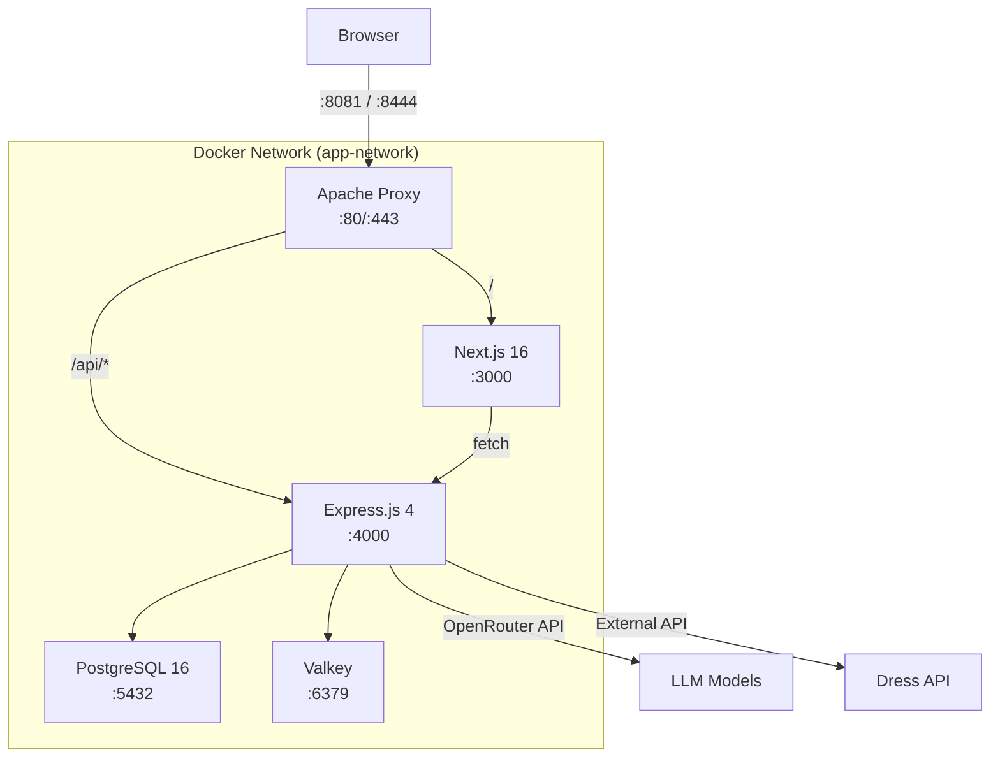
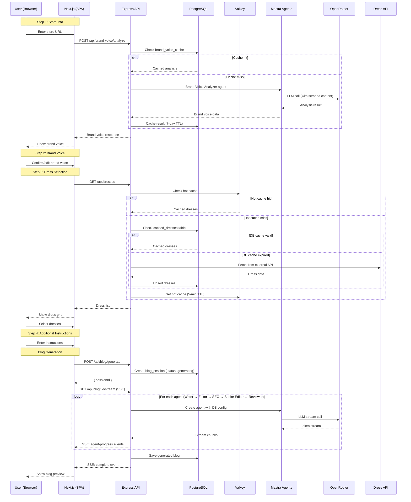

# Architecture Overview

## Purpose

Define the system topology, service boundaries, and data flow for the blogwriter platform — an AI-powered SPA that generates wedding dress blog posts through a multi-agent pipeline.

---

## System Topology

## External Ports (Host)

| Service | Port | Purpose |
|---------|------|---------|
| Proxy HTTP | 8081 | Main entry point |
| Proxy HTTPS | 8444 | SSL entry point |
| API (dev) | 4444 | Direct API access during development |
| Next.js (dev) | 4443 | Direct frontend access during development |
| Postgres | 5432 | Database access (dev tools) |
| Valkey | 6380 | Cache access (dev tools) |

---

## Service Responsibilities

### Apache Proxy
- **Routing**: `/ → Next.js`, `/api/* → Express API`
- **SSL termination**: Handles HTTPS, forwards HTTP internally
- **Static**: No application logic

### Next.js Frontend (SPA)
- **Single page application**: One page (`/`) with a 4-step wizard
- **Client-side rendering**: Wizard state managed in browser via Zustand
- **API communication**: All data fetched from Express API via `fetch()`
- **Admin page**: Hidden route at `/settings/[token]`
- **No server-side data fetching**: All API calls happen client-side

### Express API
- **REST endpoints**: Brand voice analysis, dress fetching, blog generation, admin config
- **Agent orchestration**: Creates and runs Mastra agents, streams progress via SSE
- **Data layer**: Drizzle ORM for Postgres, ioredis for Valkey
- **Validation**: Zod schemas on all input boundaries

### PostgreSQL
- **Persistent storage**: Agent model configs, cached dresses, blog sessions, brand voice cache
- **Durable cache**: Dress data and brand voice analysis with TTL-based expiration

### Valkey (Redis-compatible)
- **Hot cache**: 5-minute TTL on frequently accessed dress listings
- **Session locks**: Prevent duplicate blog generation for the same session

---

## Data Flow: Complete User Journey

---

## Service Communication

| From | To | Protocol | Auth |
|------|-----|---------|------|
| Browser → Proxy | HTTP/HTTPS | None (public) |
| Proxy → Next.js | HTTP | Internal network |
| Proxy → API | HTTP | Internal network |
| Next.js → API | HTTP fetch | None (same-origin via proxy) |
| API → Postgres | TCP (pg) | DB credentials |
| API → Valkey | TCP (Redis) | None (internal) |
| API → OpenRouter | HTTPS | API key header |
| API → Dress API | HTTPS | API key (if required) |

---

## Docker Network

All services communicate over the `app-network` bridge network. Services reference each other by container name:
- `postgres` — database host
- `valkey` — cache host
- `api` — API host (for proxy routing)
- `nextjs` — frontend host (for proxy routing)

No service is exposed to the public internet directly — all traffic goes through the Apache proxy.

---

## Deployment

### Current (Development)
- Docker Compose on local machine
- `./cli up` starts all services
- Hot reload enabled for both Next.js and Express (via tsx watch)
- Self-signed SSL certificates via `./cli certs`

### Future (Production)
- Same Docker Compose on a VPS/cloud server
- Let's Encrypt certificates via `./cli certs-renew`
- Environment variables from `.env` file or cloud secrets manager
- Consider adding health check monitoring
