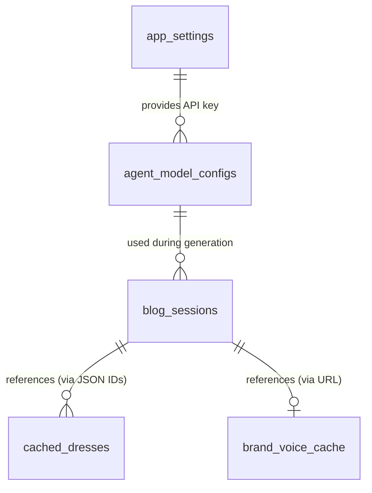

# Database Schema

## Purpose

Define all PostgreSQL tables, their relationships, and the caching strategy for the blogwriter platform.

---

## ORM: Drizzle

- **Package**: `drizzle-orm` with `pg` driver
- **Schema file**: `apps/api/src/db/schema.ts`
- **Connection**: `apps/api/src/db/index.ts`
- **Config**: `apps/api/drizzle.config.ts`
- **Migrations**: `npx drizzle-kit push` (dev), `npx drizzle-kit generate` + `npx drizzle-kit migrate` (prod)

---

## Tables

### `agent_model_configs`

Stores which LLM model each AI agent uses. Seeded with defaults on first startup.

| Column | Type | Constraints | Description |
|--------|------|------------|-------------|
| `id` | serial | PK | Auto-increment ID |
| `agent_id` | text | NOT NULL, UNIQUE | Agent identifier (e.g., `brand-voice-analyzer`) |
| `agent_label` | text | NOT NULL | Human-readable name (e.g., "Brand Voice Analyzer") |
| `model_id` | text | NOT NULL | OpenRouter model string (e.g., `openrouter/anthropic/claude-sonnet-4-5-20250929`) |
| `temperature` | text | DEFAULT '0.7' | LLM temperature setting |
| `max_tokens` | text | DEFAULT '4096' | Max output tokens |
| `created_at` | timestamp | NOT NULL, DEFAULT now() | Record creation time |
| `updated_at` | timestamp | NOT NULL, DEFAULT now() | Last update time |

**Drizzle schema:**
```typescript
export const agentModelConfigs = pgTable('agent_model_configs', {
  id: serial('id').primaryKey(),
  agentId: text('agent_id').notNull().unique(),
  agentLabel: text('agent_label').notNull(),
  modelId: text('model_id').notNull(),
  temperature: text('temperature').default('0.7'),
  maxTokens: text('max_tokens').default('4096'),
  createdAt: timestamp('created_at').defaultNow().notNull(),
  updatedAt: timestamp('updated_at').defaultNow().notNull(),
});
```

**Default seed data:**

| agent_id | agent_label | model_id | temperature |
|----------|-------------|----------|-------------|
| `brand-voice-analyzer` | Brand Voice Analyzer | `openrouter/anthropic/claude-sonnet-4-5-20250929` | 0.5 |
| `blog-writer` | Blog Writer | `openrouter/anthropic/claude-sonnet-4-5-20250929` | 0.8 |
| `blog-editor` | Blog Editor | `openrouter/anthropic/claude-sonnet-4-5-20250929` | 0.5 |
| `seo-specialist` | SEO Specialist | `openrouter/anthropic/claude-sonnet-4-5-20250929` | 0.4 |
| `senior-editor` | Senior Editor | `openrouter/anthropic/claude-sonnet-4-5-20250929` | 0.5 |
| `blog-reviewer` | Blog Reviewer | `openrouter/anthropic/claude-sonnet-4-5-20250929` | 0.3 |

---

### `cached_dresses`

Caches products from the external wedding dress API. Avoids repeated external API calls.

| Column | Type | Constraints | Description |
|--------|------|------------|-------------|
| `id` | serial | PK | Auto-increment ID |
| `external_id` | text | NOT NULL, UNIQUE | ID from the external API |
| `name` | text | NOT NULL | Dress name |
| `designer` | text | | Designer/brand name |
| `description` | text | | Product description |
| `price` | text | | Price string (e.g., "$2,499") |
| `image_url` | text | | Product image URL |
| `category` | text | | Style category (e.g., "A-line", "Mermaid") |
| `tags` | text | | JSON array of tags |
| `raw_data` | text | | Full JSON from external API |
| `cached_at` | timestamp | NOT NULL, DEFAULT now() | When this record was cached |
| `expires_at` | timestamp | NOT NULL | Cache expiration (24h from cached_at) |

**Drizzle schema:**
```typescript
export const cachedDresses = pgTable('cached_dresses', {
  id: serial('id').primaryKey(),
  externalId: text('external_id').notNull().unique(),
  name: text('name').notNull(),
  designer: text('designer'),
  description: text('description'),
  price: text('price'),
  imageUrl: text('image_url'),
  category: text('category'),
  tags: text('tags'),
  rawData: text('raw_data'),
  cachedAt: timestamp('cached_at').defaultNow().notNull(),
  expiresAt: timestamp('expires_at').notNull(),
});
```

---

### `blog_sessions`

Tracks each blog generation session from wizard input through final output.

| Column | Type | Constraints | Description |
|--------|------|------------|-------------|
| `id` | text | PK, DEFAULT uuid | Session UUID |
| `store_url` | text | | User-provided store URL |
| `brand_voice` | text | | JSON: confirmed brand voice analysis |
| `selected_dress_ids` | text | | JSON: array of selected dress external IDs |
| `additional_instructions` | text | | User's extra guidance text |
| `status` | text | NOT NULL, DEFAULT 'draft' | `draft` / `generating` / `completed` / `failed` |
| `generated_blog` | text | | Final blog content (Markdown) |
| `seo_metadata` | text | | JSON: title, description, keywords |
| `agent_log` | text | | JSON: log of each agent's pass |
| `created_at` | timestamp | NOT NULL, DEFAULT now() | Session creation time |
| `updated_at` | timestamp | NOT NULL, DEFAULT now() | Last update time |

**Drizzle schema:**
```typescript
export const blogSessions = pgTable('blog_sessions', {
  id: text('id').primaryKey().$defaultFn(() => crypto.randomUUID()),
  storeUrl: text('store_url'),
  brandVoice: text('brand_voice'),
  selectedDressIds: text('selected_dress_ids'),
  additionalInstructions: text('additional_instructions'),
  status: text('status').default('draft').notNull(),
  generatedBlog: text('generated_blog'),
  seoMetadata: text('seo_metadata'),
  agentLog: text('agent_log'),
  createdAt: timestamp('created_at').defaultNow().notNull(),
  updatedAt: timestamp('updated_at').defaultNow().notNull(),
});
```

**Status lifecycle:**
```
draft → generating → completed
                  ↘ failed
```

---

### `brand_voice_cache`

Caches brand voice analysis per URL to avoid redundant LLM calls.

| Column | Type | Constraints | Description |
|--------|------|------------|-------------|
| `id` | serial | PK | Auto-increment ID |
| `url` | text | NOT NULL, UNIQUE | Analyzed store URL |
| `analysis_result` | text | NOT NULL | JSON: full brand voice analysis |
| `cached_at` | timestamp | NOT NULL, DEFAULT now() | When analysis was cached |
| `expires_at` | timestamp | NOT NULL | Cache expiration (7 days from cached_at) |

**Drizzle schema:**
```typescript
export const brandVoiceCache = pgTable('brand_voice_cache', {
  id: serial('id').primaryKey(),
  url: text('url').notNull().unique(),
  analysisResult: text('analysis_result').notNull(),
  cachedAt: timestamp('cached_at').defaultNow().notNull(),
  expiresAt: timestamp('expires_at').notNull(),
});
```

### `app_settings`

Stores application-level settings like API keys. Key-value store managed via the admin panel.

| Column | Type | Constraints | Description |
|--------|------|------------|-------------|
| `id` | serial | PK | Auto-increment ID |
| `key` | text | NOT NULL, UNIQUE | Setting key (e.g., `openrouter_api_key`) |
| `value` | text | NOT NULL | Setting value |
| `updated_at` | timestamp | NOT NULL, DEFAULT now() | Last update time |

**Drizzle schema:**
```typescript
export const appSettings = pgTable('app_settings', {
  id: serial('id').primaryKey(),
  key: text('key').notNull().unique(),
  value: text('value').notNull(),
  updatedAt: timestamp('updated_at').defaultNow().notNull(),
});
```

**Default seed data:**

| key | value |
|-----|-------|
| `openrouter_api_key` | `''` (empty — set via admin panel) |

---

## Entity Relationships



- `blog_sessions.selected_dress_ids` stores JSON array referencing `cached_dresses.external_id`
- `blog_sessions.store_url` can match `brand_voice_cache.url`
- `agent_model_configs` are read during blog generation to configure each agent
- `app_settings` stores the OpenRouter API key used by all agents
- No foreign key constraints between tables — loose coupling via IDs and URLs

---

## Caching Strategy

### Two-Layer Cache for Dresses

```
Request → Valkey (hot cache, 5-min TTL)
            ↓ miss
        → Postgres cached_dresses (durable cache, 24h TTL)
            ↓ miss/expired
        → External Dress API → Upsert into Postgres → Set Valkey
```

- **Valkey**: Prevents repeated Postgres queries during rapid UI navigation (user going back and forth between steps)
- **Postgres**: Durable cache that survives container restarts

### Brand Voice Cache

```
Request → Postgres brand_voice_cache (7-day TTL)
            ↓ miss/expired
        → Mastra Brand Voice Agent → LLM call → Cache in Postgres
```

- 7-day TTL because brand voice changes infrequently
- Same URL always returns the same cached result within TTL

---

## Data Lifecycle

| Data | TTL | Cleanup |
|------|-----|---------|
| Dress cache (Valkey) | 5 minutes | Auto-expires |
| Dress cache (Postgres) | 24 hours | Re-fetched on next request after expiry |
| Brand voice cache | 7 days | Re-analyzed on next request after expiry |
| Blog sessions | Permanent | Manual cleanup (future: add retention policy) |
| Agent model configs | Permanent | Admin-managed |

---

## Migration Strategy

### Development
```bash
cd apps/api
npx drizzle-kit push
```
Pushes schema changes directly to the database without migration files. Fast iteration.

### Production
```bash
cd apps/api
npx drizzle-kit generate    # Creates migration SQL files
npx drizzle-kit migrate     # Applies migrations
```
Migration files are committed to version control in `apps/api/drizzle/` directory.
