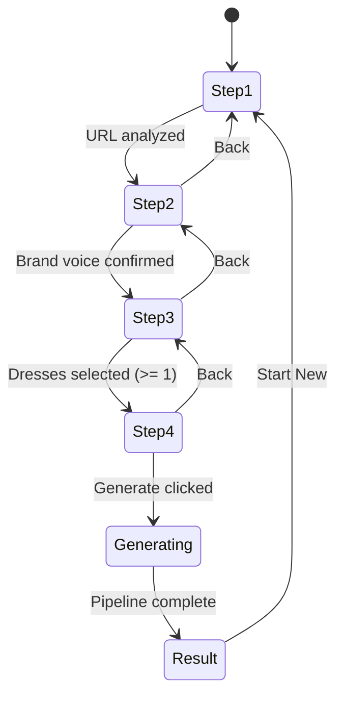

# Frontend Components

## Purpose

Define the component architecture, state management, and UI design for the blogwriter SPA.

---

## Architecture: Single Page Application

The entire app lives on one page (`app/page.tsx`). All navigation is state-driven — no route changes during the wizard flow. The single page renders different views based on the current state:

- **Wizard view**: 4-step form with stepper indicator
- **Generating view**: Progress indicator showing agent pipeline status
- **Result view**: Final blog preview with export actions

---

## Component Hierarchy

```
app/page.tsx (entry point, 'use client')
├── wizard/
│   ├── StepIndicator              # Horizontal stepper bar
│   ├── StoreInfoStep              # Step 1: URL input
│   ├── BrandVoiceStep             # Step 2: Brand voice review
│   ├── DressSelectionStep         # Step 3: Dress selection grid
│   └── AdditionalInstructionsStep # Step 4: Instructions textarea
├── blog/
│   ├── BlogGenerator              # Generation progress (SSE consumer)
│   └── BlogPreview                # Final blog display + actions
└── admin/
    └── AgentConfigPanel           # Model config (separate page)
```

Components are organized by feature domain under `components/`. See [Coding Standards > File Organization](../guidelines/coding-standards.md#file-organization) for the full folder rule.

---

## Files to Create

| File | Purpose |
|------|---------|
| `components/wizard/StepIndicator.tsx` | Horizontal stepper bar |
| `components/wizard/StoreInfoStep.tsx` | Step 1 UI |
| `components/wizard/BrandVoiceStep.tsx` | Step 2 UI |
| `components/wizard/DressSelectionStep.tsx` | Step 3 UI |
| `components/wizard/AdditionalInstructionsStep.tsx` | Step 4 UI |
| `components/blog/BlogGenerator.tsx` | Generation progress view |
| `components/blog/BlogPreview.tsx` | Blog result + actions |
| `components/admin/AgentConfigPanel.tsx` | Admin model config panel |
| `stores/wizard-store.ts` | Zustand store |
| `lib/api.ts` | API client functions |
| `types/index.ts` | Shared TypeScript types |

---

## State Management (Zustand)

### Store Design (`stores/wizard-store.ts`)

```typescript
import { create } from 'zustand';

interface BrandVoice {
  brandName: string;
  tone: string[];
  targetAudience: string;
  priceRange: string;
  uniqueSellingPoints: string[];
  suggestedBlogTone: string;
  summary: string;
}

interface Dress {
  externalId: string;
  name: string;
  designer?: string;
  description?: string;
  price?: string;
  imageUrl?: string;
  category?: string;
}

type WizardStep = 1 | 2 | 3 | 4;
type AppView = 'wizard' | 'generating' | 'result';

interface WizardState {
  // Navigation
  currentStep: WizardStep;
  view: AppView;

  // Step 1: Store Info
  storeUrl: string;
  isAnalyzing: boolean;

  // Step 2: Brand Voice
  brandVoice: BrandVoice | null;
  brandVoiceConfirmed: boolean;

  // Step 3: Dresses
  availableDresses: Dress[];
  selectedDressIds: Set<string>;
  isDressesLoading: boolean;
  dressSearchQuery: string;
  dressCategory: string;
  dressPage: number;
  dressTotalPages: number;

  // Step 4: Instructions
  additionalInstructions: string;

  // Generation
  sessionId: string | null;
  generationAgent: string;
  generationStep: number;
  generationTotalSteps: number;

  // Result
  generatedBlog: string | null;
  seoMetadata: { title: string; description: string; keywords: string[] } | null;

  // Actions
  setStep: (step: WizardStep) => void;
  setView: (view: AppView) => void;
  setStoreUrl: (url: string) => void;
  setIsAnalyzing: (loading: boolean) => void;
  setBrandVoice: (bv: BrandVoice) => void;
  confirmBrandVoice: () => void;
  setAvailableDresses: (dresses: Dress[]) => void;
  toggleDress: (id: string) => void;
  setDressesLoading: (loading: boolean) => void;
  setDressSearch: (query: string) => void;
  setDressCategory: (category: string) => void;
  setDressPage: (page: number) => void;
  setDressPagination: (total: number, totalPages: number) => void;
  setAdditionalInstructions: (text: string) => void;
  setSessionId: (id: string) => void;
  updateGeneration: (agent: string, step: number, total: number) => void;
  setGeneratedBlog: (blog: string, seo?: { title: string; description: string; keywords: string[] }) => void;
  reset: () => void;
}
```

### Selector Usage Pattern

Components subscribe only to the slices they need:

```typescript
// StoreInfoStep only re-renders when these values change
const storeUrl = useWizardStore(s => s.storeUrl);
const setStoreUrl = useWizardStore(s => s.setStoreUrl);
const isAnalyzing = useWizardStore(s => s.isAnalyzing);
```

---

## Component Specifications

### StepIndicator

**Purpose:** Horizontal stepper showing wizard progress.

**Reads from store:** `currentStep`

**UI:**
```
 📦 STORE INFO ————— 📢 BRAND VOICE ————— ⭐ WEDDING DRESSES ————— 📝 ADDITIONAL INSTRUCTIONS
```

- Each step: icon + label (uppercase)
- Active step: blue icon, blue text
- Completed step: checkmark icon, blue text, clickable (navigates back)
- Future step: gray icon, gray text, not clickable
- Steps connected by horizontal lines (blue = completed, gray = upcoming)

**Props:** None (reads from Zustand store directly)

**User interactions:**
- Click completed step → navigate back to that step

---

### StoreInfoStep

**Purpose:** User enters their store URL.

**Reads from store:** `storeUrl`, `isAnalyzing`
**Writes to store:** `setStoreUrl`, `setIsAnalyzing`, `setBrandVoice`, `setStep`

**UI (matching screenshot):**
- Large bold heading: "Store Website"
- Single input field with placeholder: "Copy and paste your home page or favorite blog post here"
- Blue "NEXT" button with play icon, right-aligned
- Loading state: input disabled, button shows spinner + "Analyzing..."
- Error state: red text below input

**User interactions:**
- Type/paste URL into input
- Click NEXT → calls `analyzeBrandVoice(url)` → on success, sets brand voice and moves to step 2
- During analysis: input and button disabled

---

### BrandVoiceStep

**Purpose:** User reviews and confirms the AI-analyzed brand voice.

**Reads from store:** `brandVoice`, `brandVoiceConfirmed`
**Writes to store:** `setBrandVoice`, `confirmBrandVoice`, `setStep`

**UI:**
- Large heading with brand name
- Tone badges (colored pills)
- Labeled fields: Target Audience, Price Range
- Bulleted list: Unique Selling Points
- Suggested blog tone (italic text)
- Summary paragraph
- "Edit" toggle button → makes fields editable (inputs/textareas replace display text)
- "Confirm & Continue" button → moves to step 3
- "Back" button → returns to step 1

**Placeholder data (until backend is wired):**
```typescript
const PLACEHOLDER_BRAND_VOICE: BrandVoice = {
  brandName: 'Elegant Bridal',
  tone: ['sophisticated', 'romantic', 'warm'],
  targetAudience: 'Brides aged 25-40 looking for designer gowns',
  priceRange: 'Premium ($2,000 - $6,000)',
  uniqueSellingPoints: ['Exclusive designer collections', 'Personal styling consultations', 'In-house alterations'],
  suggestedBlogTone: 'Warm and knowledgeable, like a trusted friend in the bridal industry',
  summary: 'A premium bridal boutique focused on personalized service and curated designer collections.',
};
```

---

### DressSelectionStep

**Purpose:** User browses and selects dresses to feature in the blog.

**Reads from store:** `availableDresses`, `selectedDressIds`, `isDressesLoading`, `dressSearchQuery`, `dressCategory`, `dressPage`
**Writes to store:** `toggleDress`, `setDressSearch`, `setDressCategory`, `setDressPage`

**UI:**
- Search input + category filter dropdown at top
- Grid of dress cards (3 columns desktop, 2 tablet, 1 mobile)
- Each card:
  - Image (or gray placeholder square)
  - Dress name (bold)
  - Designer name
  - Price
  - Category badge
  - Selected state: blue border + checkmark overlay
- Selection count: "X dresses selected" (min 1 required to proceed)
- Pagination: "Page 1 of 8" with prev/next buttons
- "Next" button (disabled if 0 selected) → moves to step 4
- "Back" button → returns to step 2

**Placeholder data (until backend is wired):**
```typescript
const PLACEHOLDER_DRESSES: Dress[] = [
  { externalId: '1', name: 'Aurora A-Line', designer: 'Vera Wang', price: '$3,200', category: 'A-line' },
  { externalId: '2', name: 'Celestia Mermaid', designer: 'Monique Lhuillier', price: '$4,800', category: 'Mermaid' },
  { externalId: '3', name: 'Luna Ball Gown', designer: 'Oscar de la Renta', price: '$5,500', category: 'Ball Gown' },
  // ... 9+ more for pagination demo
];
```

---

### AdditionalInstructionsStep

**Purpose:** User provides extra guidance for the blog.

**Reads from store:** `additionalInstructions`, `storeUrl`, `brandVoice`, `selectedDressIds`
**Writes to store:** `setAdditionalInstructions`, `setView`, `setSessionId`

**UI:**
- Heading: "Additional Instructions"
- Large textarea (6+ rows) with placeholder examples:
  "Optional: Add topic focus, keywords, style tips, seasonal themes..."
- Summary section showing:
  - Store URL
  - Brand voice summary (1-2 lines)
  - Number of dresses selected
- "Generate Blog" button (primary, prominent) → starts generation
- "Back" button → returns to step 3

**User interactions:**
- Type instructions (optional)
- Click "Generate Blog" → calls `startBlogGeneration()` → switches view to `generating`

---

### BlogGenerator

**Purpose:** Shows real-time progress during blog generation.

**Reads from store:** `sessionId`, `generationAgent`, `generationStep`, `generationTotalSteps`
**Writes to store:** `updateGeneration`, `setGeneratedBlog`, `setView`

**UI:**
- Centered layout
- Pipeline visualization: vertical list of 5 agent steps
  - Completed: checkmark + agent name + "Done"
  - Active: spinner + agent name + "Working..."
  - Pending: gray circle + agent name
- Progress bar showing step X of 5
- Optional: streaming text preview (collapsible panel showing current agent output)
- "Cancel" button (future — for MVP, user waits)

**SSE consumption:**
```typescript
useEffect(() => {
  if (!sessionId) return;
  const es = new EventSource(`${API_BASE}/api/blog/${sessionId}/stream`);

  es.addEventListener('agent-start', (e) => {
    const data = JSON.parse(e.data);
    updateGeneration(data.agent, data.step, data.totalSteps);
  });

  es.addEventListener('complete', (e) => {
    const data = JSON.parse(e.data);
    setGeneratedBlog(data.blog, data.seoMetadata);
    setView('result');
    es.close();
  });

  es.addEventListener('error', () => { es.close(); });

  return () => es.close();
}, [sessionId]);
```

---

### BlogPreview

**Purpose:** Renders the final blog and provides export actions.

**Reads from store:** `generatedBlog`, `seoMetadata`

**UI:**
- Blog rendered in a clean reading layout using custom SCSS typography styles in `globals.scss`
- SEO metadata shown in a collapsible section (title, description, keywords)
- Action buttons:
  - "Copy Markdown" → copies raw markdown to clipboard
  - "Copy HTML" → copies rendered HTML to clipboard
  - "Start New Blog" → calls `reset()`, returns to step 1

---

## Wizard Navigation Rules



**Rules:**
- Forward navigation requires completing the current step
- Back navigation is always allowed
- Clicking a completed step in the stepper navigates back
- Future steps are not directly accessible
- The Generate button only appears on step 4
- After generation, "Start New" resets the entire wizard

---

## Responsive Breakpoints

| Breakpoint | Layout Changes |
|------------|---------------|
| < 640px (mobile) | Single column. Stepper labels hidden (icons only). Dress grid: 1 column. |
| 640px - 1024px (tablet) | Stepper labels visible. Dress grid: 2 columns. |
| > 1024px (desktop) | Full layout. Dress grid: 3 columns. |

---

## Styling Notes

- Cream background (`--color-bg: #f5f5f0`) with white paper card (`.paper`) — "paper on desk" aesthetic
- Clean sans-serif font (Inter, already configured)
- Primary blue accent (`--color-blue: #5b9bf5`)
- All styling via pure SCSS with BEM naming in `globals.scss` — no Tailwind, no shadcn/ui
- CSS custom properties (design tokens) for colors, shadows, radii
- Responsive: mobile progress bar + label, desktop horizontal stepper
- No inline styles — use SCSS classes from `globals.scss`
